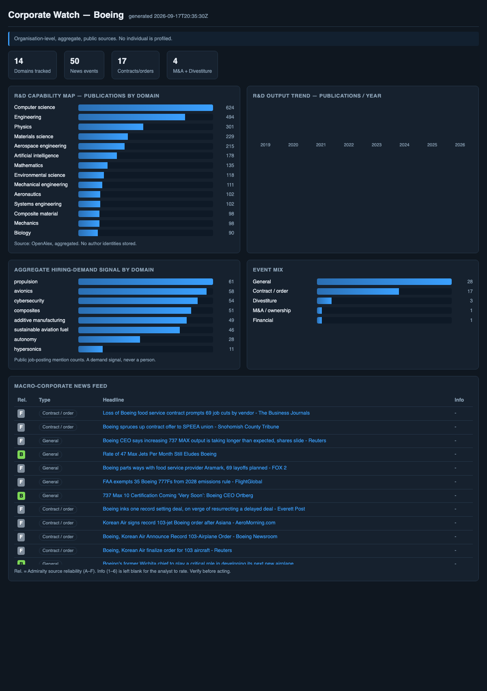

# Corporate Watch — aggregate competitive-intelligence monitor

A **Day 3 capstone example**: an automated, scheduled OSINT monitor that tracks a target
**company** at the **organisation level** — its R&D direction, its macro-corporate moves
(contracts, M&A, divestitures, service/production stops) and its aggregate hiring demand
by research domain — and renders it on a dashboard.



## Scope & compliance (read first)

This tool is deliberately **organisation-level and aggregate**. It answers *"where is this
company investing, what is it deciding, which domains is it growing in"* — never *"who works
there"*.

**Included (public, lawful, aggregate):**
- R&D capability map and trend from **OpenAlex** — publication *counts* by research concept and
  by year. Author identities are fetched only to be counted, and are **discarded**, never stored.
- Macro-corporate **news events** from keyless RSS (Google News + aviation press), auto-classified
  (contract, M&A, divestiture, service/production stop, restructuring, regulatory…) and tagged with
  an **Admiralty source-reliability** letter (A–F). The information-credibility digit (1–6) is left
  blank for the analyst — the machine proposes, the human rates.
- **Aggregate hiring-demand signal**: public job-posting *mention counts* by domain. A demand
  signal, never a person.

**Deliberately excluded:** any profiling of individuals — named employees, new-hire lists,
personal LinkedIn profiles, skills tied to a person. Scraping LinkedIn to build and refresh a
base of identified people is a compilation of personal data without a legal basis and against
LinkedIn's terms; it is out of scope of this tool by design. `backend/common.py:drop_personal`
is a last-line guard that rejects any row carrying a personal-profile marker.

> Teaching point (Day 2 → Day 3): the deliverable is an **Admiralty-rated, provenance-carrying**
> feed. Data minimisation is not a footnote — it is the design.

## Architecture

```
backend/
  watch.py            orchestrator: run collectors -> normalise -> write data/ + frontend/data.js
  common.py           schema, Admiralty reliability map, event taxonomy, drop_personal guard
  sources/
    rnd.py            OpenAlex: concepts + yearly trend (keyless)
    news.py           Google News RSS + aviation-press RSS (keyless)
    hiring.py         aggregate job-posting demand by domain (keyless proxy)
frontend/
  index.html          static dashboard (opens from file://, reads data.js)
data/
  aggregate.json      the normalised output
```

## Run

```bash
cd "Day_3/Corporate Watch Lab"
python3 backend/watch.py --company Boeing        # stdlib only, no pip needed
open frontend/index.html                          # or double-click it
```

Point it at any company with `--company "<name>"`. For OpenAlex R&D, set the target institution
id in `backend/sources/rnd.py` (find it at `https://api.openalex.org/institutions?search=<name>`).

## Schedule it (the "monitor" part)

The original brief wanted periodic refreshes. Do it with cron on the **aggregate** job:

```cron
# Weekly R&D + news refresh, Sundays 06:00 UTC
0 6 * * 0  cd "/path/Day_3/Corporate Watch Lab" && /usr/bin/python3 backend/watch.py --company Boeing
```

For change alerts, diff `data/aggregate.json` between runs and notify on new high-value events
(new M&A / divestiture / service-stop) — the Day 1 pipeline discipline (idempotent, timestamped).

## Extending (optional, needs keys)

- **Patents** (a strong R&D-direction signal): add a connector for EPO OPS or Lens.org
  (`assignee = company`, group by CPC class). Aggregate by class, discard inventor names.
- **Official job data**: replace the news proxy in `hiring.py` with an employer jobs API under a
  proper agreement — still counted, still no individuals.
- **Forums / social pulse** (Reddit, aviation boards): add an org-level topic reader. Rate these
  low on the Admiralty scale (D–E) and never use them to identify people.

## Why not the individual-level version

Counting experts by domain, tracking corporate decisions and reading market signals are all
achievable — and more robust — from aggregate public sources. Building a name-keyed, monthly-
refreshed base of a competitor's engineers is a personal-data surveillance system: different
activity, different law, and out of scope here. The technique is neutral; the authorisation and
the level of aggregation are what keep it legitimate.
